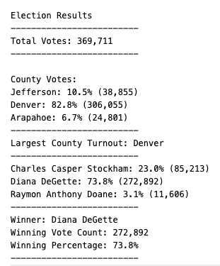
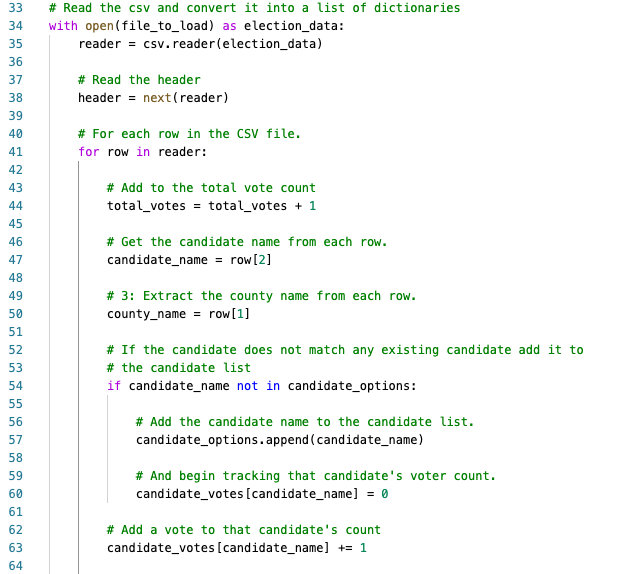
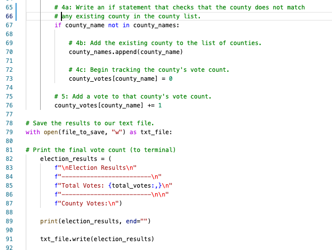
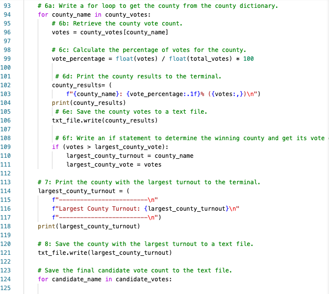

# Election Audit

## Overview
The Colorado Board of Elections requested an audit of a recent local congressional election. The following results were complied.

* Total number of votes cast
* Breakdown of the number of votes and the percentage of total votes for each county in the precinct
* The county with the largest voter turnout
* Breakdown of the number of votes and the percentage of the total votes each candidate received
* Which candidate won the election, what was their vote count, and what was their percentage of the total votes?

Link to election data source: https://github.com/mirandawylie/election-analysis/blob/39cd0a149d9f51a91857ef993907d48588810aef/Resources/election_results.csv

## Results
The analysis of the election shows that:

* 369,711 votes casted
* County breakdown
	- Denver: 82.8% (306,055)
	- Jefferson: 10.5% (38,855)
	- Arapahoe: 6.7% (24,801)
* Denver had the largest voter turnout
* Candidate results
	- Diana DeGette: 73.8% (272,892)
	- Charles Casper Stockham: 23.0% (85,213)
	- Raymon Anthony Doane: 3.1% (11,606)
* Winner
	- Diana DeGette, 272,892 vote count and 73.8% percentage of the total votes

## Summary
This election analysis audit proves to be a powerful tool to understand the recent Colorado local congressional election and can be used for any election with additional outcomes offerings.

The election analysis script can be used for any election by importing a different .csv file. Instead of the winner, the top three candidates could be identified noting the percentage differences between each candidate. The age and gender identity of each candidate could be inputted in the data to better understand the similarities and difference with each candidate. And lastly, with additional data on registered voters we could compare voter turnout and registered voters. 
